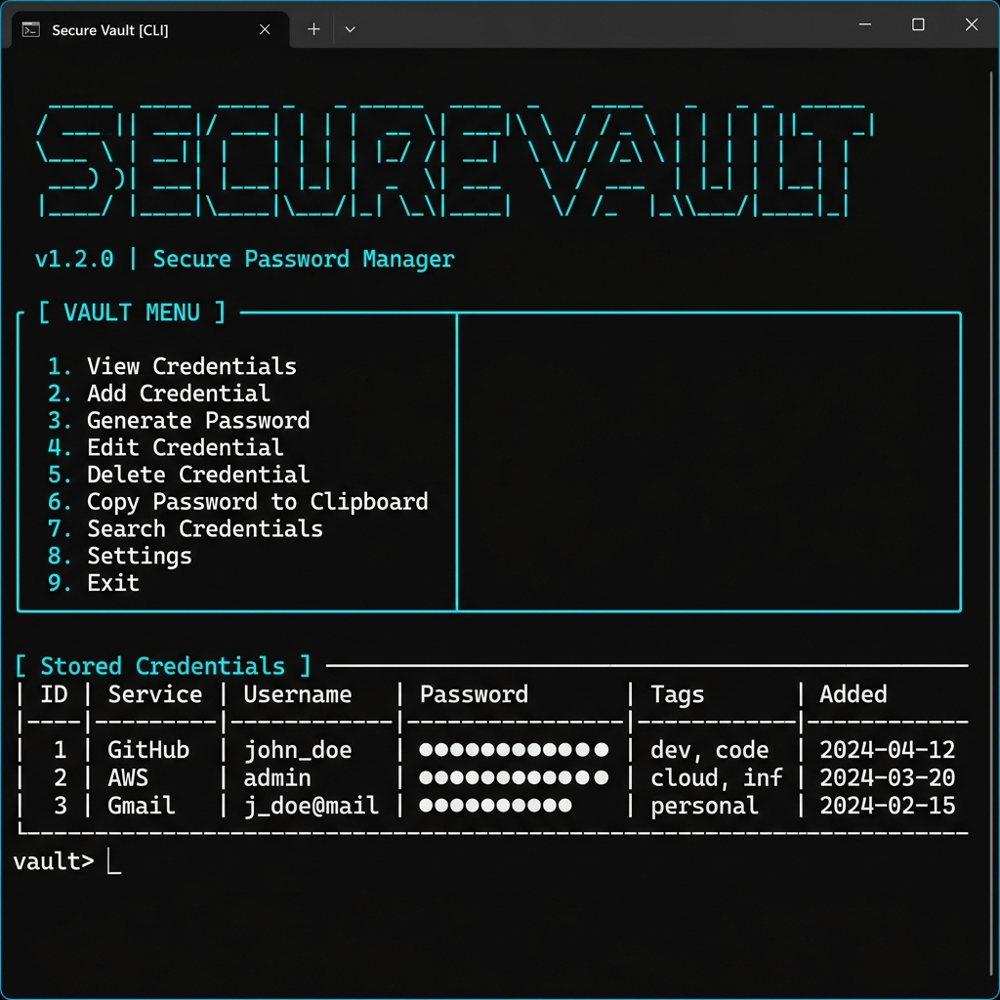
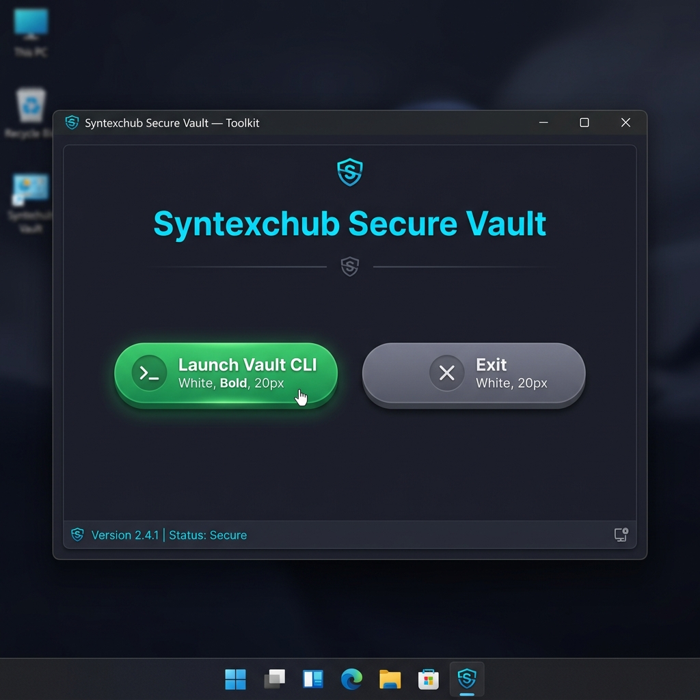

# Syntexchub Secure Vault





> A military-grade local encrypted password vault and credential security manager designed for cybersecurity students and professionals.

---

## Security Architecture

| Layer | Technology | Purpose |
|-------|-----------|---------|
| **Authentication** | Argon2id | Master password hashing — resistant to GPU/ASIC brute-force |
| **Key Derivation** | PBKDF2-HMAC-SHA256 (600k iterations) | Derives encryption key from master password + unique salt |
| **Encryption** | AES via Fernet | Encrypts the entire vault database at rest |
| **Audit** | File-based logger | Tracks all access and modifications without exposing secrets |
| **Lockout** | 5-attempt max | Locks the vault after consecutive failed login attempts |

---

## Features

- **Full CRUD**: Add, view, search, update, and delete credentials
- **Password Generator**: Cryptographically secure with entropy scoring (Weak → Excellent)
- **Encrypted Backup**: Export the vault as an encrypted `.enc` file
- **Tags & Notes**: Organize credentials by category and add contextual notes
- **Audit Trail**: Every login, access, and modification is logged
- **Pygame GUI**: Graphical launcher with dark cyber theme
- **Tamper Detection**: Fernet's built-in HMAC catches any unauthorized modifications

---

## Installation

```bash
git clone https://github.com/nullfist/Syntexchub_SecureVault.git
cd Syntexchub_SecureVault

# Option 1: Setup script (Windows)
setup.bat

# Option 2: Manual
pip install -r requirements.txt
```

---

## Usage

### CLI Mode
```bash
python main.py
```

On first run you'll set a Master Password. This password is the **only** way to access your data — there is no recovery mechanism by design.

### GUI Mode
```bash
python gui_launcher.py
# Or double-click run.bat
```

### Menu Options

| # | Action | Description |
|---|--------|-------------|
| 1 | View Credentials | Lists all entries; select an ID to reveal the password |
| 2 | Add Credential | Store a new service/username/password (auto-generate available) |
| 3 | Search | Filter by service name, username, or tags |
| 4 | Update | Modify any field of an existing entry |
| 5 | Delete | Remove an entry permanently |
| 6 | Generate Password | Standalone tool with entropy scoring |
| 7 | Export | Create an encrypted backup of the vault |
| 8 | Audit Logs | View recent security events |
| 9 | Exit | Lock the vault and quit |

---

## Project Structure

```
Syntexchub_SecureVault/
├── vault/
│   ├── __init__.py
│   ├── crypto.py       # AES encryption + PBKDF2 key derivation
│   ├── auth.py         # Argon2id authentication + lockout
│   ├── storage.py      # Encrypted JSON persistence
│   ├── generator.py    # Password generator + entropy scoring
│   └── audit.py        # Security event logger
├── data/               # Encrypted vault + auth files (gitignored)
├── logs/               # Audit logs
├── tests/
├── gui_launcher.py     # Pygame graphical launcher
├── main.py             # CLI entry point
├── setup.bat
├── run.bat
├── requirements.txt
└── README.md
```

---

## Threat Model

- ✅ **Protects against**: Unauthorized local access without the master password
- ✅ **Protects against**: Database file theft (data is encrypted at rest)
- ✅ **Protects against**: Online brute-force (Argon2id + lockout)
- ⚠️ **Out of scope**: Keyloggers, memory forensics, OS-level root compromise

---

## ⚖️ Ethical Disclaimer

This tool is for **personal security management and educational purposes only**. The developers assume no liability for data loss or security breaches resulting from use or misuse.

---

*Built with 🔐 by Syed — for the Cybersecurity Community*
